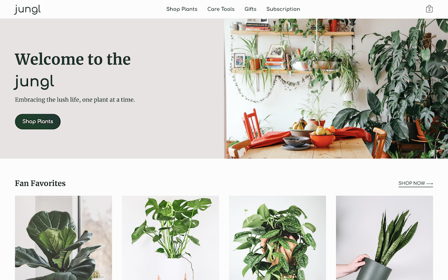
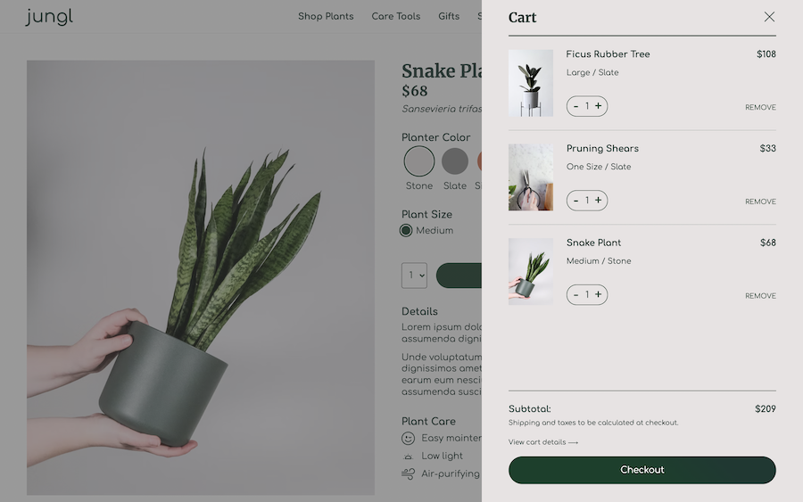

## Jungl - E-Commerce Application

Designed and built by Carolyn Lau

### Overview

Jungl is an e-commerce experience that allows users to browse and shop for indoor plants. Users are able to:

1.  Browse plants by category.
2.  Sort plants based on price, feature, new/old etc.
3.  View and customize plant details.
4.  Add/remove plants to the user cart.
5.  Finalize user cart and complete checkout flow

User cart is saved to local storage.

### View Live Site

Live site URL: [https://jungl.netlify.app/](https://jungl.netlify.app/)

### Screenshots

### Set-up

1. Clone this repository to your desktop. [[https://github.com/carolyndev/jungl.git]](https://github.com/carolyndev/jungl.git)
2. From your device's terminal, `cd` into the project directory.
3. Run `npm start` to open the app in the development mode and view it in your browser. [[localhost:3000]](http://localhost:3000)
4. Run `npm run build` to create your optimized production build.

### Run Checks
- Typings: `npm run tsc`

### Project Goals and Challenges

### Continued development

### Acknowledgements

Page refresh redirect script courtesy of [Rafael Pedicini](https://github.com/rafgraph/spa-github-pages).
